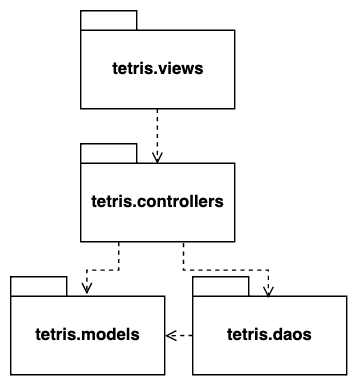
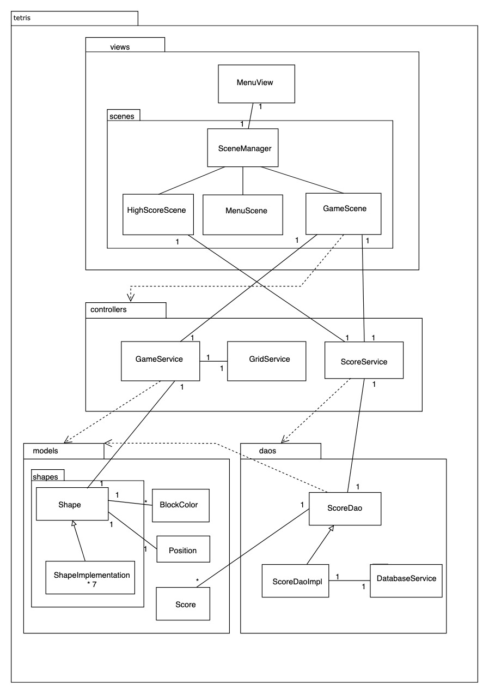
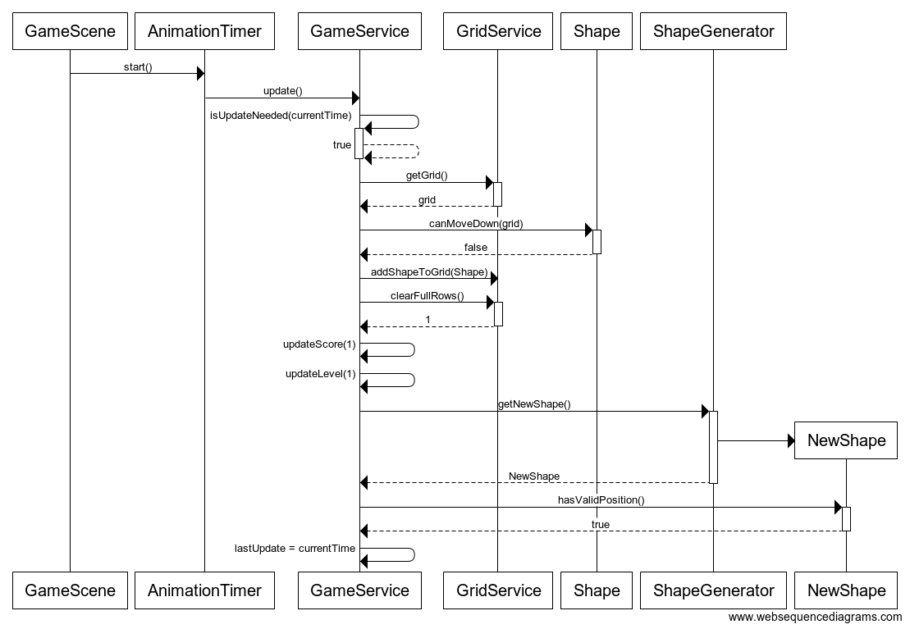
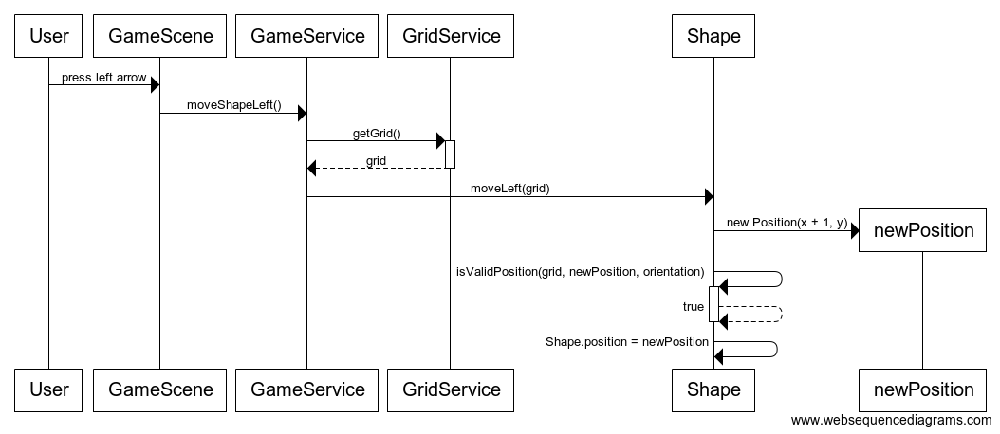

# Arkkitehtuurikuvaus
## Pakkausrakenne
Sovelluksen rakenne on variaatio kolmitasoisesta kerrosarkkitehtuurista,
ja sen pakkausrakenne on seuraavanlainen:

Tetris.views pakkaus sisältää pelin näyttämiseen ja käyttöliittymään liittyvän koodin.
Tetris.controllers sisältää pelin logiikan ja vastaa pelitilanteen päivittämisestä.
Tetris.daos vastaa tietokantaoperaatioista, ja tetris.models pakkaus sisältää sovelluksen käyttämät datamallit.

## Rakenne
Sovelluksen luokka- ja pakkausrakenne on kuvattu seuraavassa kaaviossa. Luokkiin injektoidaan niiden riippuvuudet
konstruktoria kutsuttaessa.

### Käyttöliittymä

Käyttöliittymä sisältää kolme näkymää: menun, pistetilaston ja pelinäkymän, joista jokaisella on oma Scene-olionsa.
SceneManager-luokka hallinnoi näkymiä ja asettaa näytettävän näkymään Stage-olioon.

Pistetilaston näyttävä HighScoreScene hakee tarvittavan tiedon kutsumalla ScoreService-luokan metodeja. GameScene-luokka
piirtää Canvas-oliota käyttäen pelitilanteen. GameScene päivittää pelitilanteen tietyin väliajoin sekä käsittelee käyttäjän
antamat käskyt kutsumalla GameService-luokan metodeja. Kun peli päättyy, GameScene kutsuu ScoreServicen metodia ja
tallentaa uudet pisteet.

### Sovelluslogiikka

GameService vastaa pelitilanteesta eli pelissä olevasta palikasta, aiemmat palikat sisältävästä taulukosta,
pistetilanteesta ja pelin tasosta. GameService lisää taulukkoon uuden palikan tai poistaa täysiä rivejä kutsumalla
GridService-luokkaa, joka sisältää taulukon käsittelyyn liittyvän logiikan.

Pelissä olevaa palikkaa, jota käyttäjä voi liikutella, kuvaa abstrakti Shape-luokka. Se sisältää palikan liikuttamiseen
ja pyörittämiseen liittyvän logiikan, ja Shape-luokasta periytyvät, erimuotoisia palikoita kuvaavat, luokat sisältävät
ainoastaan palikan eri orientaatiot ja värin.  

### Tallennuslogiikka

ScoreDao-rajapinta tarjoaa sovelluslogiikan käyttöön metodit uusien pisteiden tallennukseen sekä parhaiden pisteiden
hakemiseen. Sen toteuttava ScoreDaoImpl-luokka sisältää logiikan pisteiden tallentamiseen sql-tietokantaan ja
tiedon hakemiseen tietokannasta. ScoreDaoImpl ottaa DatabaseService-luokan avulla yhteyden sovelluksen käyttämään h2-tietokantaan.

## Toiminnallisuus

### Pelitilanteen päivittyminen

GameScene-luokan AnimationTimer piirtää pelitilanteen ja kutsuu GameServicen update-metodia, joka päivittää pelitilanteen
kun edellisestä päivityksestä on kulunut tarpeeksi. Jos palikka voi liikkua alaspäin, sitä pudotetaan taulukossa
yksi rivi.

Jos palikka ei voi enää pudota, se lisätään taulukkoon. Tämän jälkeen GameService tyhjentää täydet rivit kutsumalla
GridServicen clearFullRows-metodia, ja päivittää täysien rivien perusteella pistetilanteen ja pelin vaikeustason. Sen
jälkeen peliin lisätään uusi palikka. Jos lisätty palikka on aiempien palikoiden päällä, GameService merkitsee pelin
päättyneeksi.

Kaavio pelitilanteen päivityksestä, kun palikka on pudonnut ja muodostanut yhden täyden rivin. Uuden palikan lisäämisen
jälkeen peli jatkuu.

### Palikan liikuttaminen

Pelinäkymässä GameScene-luokan EventHandler kuuntelee pelaajan tekemiä näppäimen painalluksia, ja välittää
komennot eteenpäin kutsumalla GameService-luokan moveShapeLeft-, moveShapeRight-, rotateShape- ja dropShape-metodeja.

Kaavio palikan liikuttamisesta vasemmalle:

GameService pyytää GridService-luokalta pelitilannetta kuvaavan
taulukon, ja yrittää siirtää palikkaa vasemmalle. Shape-luokka tarkistaa, voiko palikka
liikkua haluttuun suuntaan. Jos liikkuminen onnistuu, palikan sijainti päivitetään. 
 
