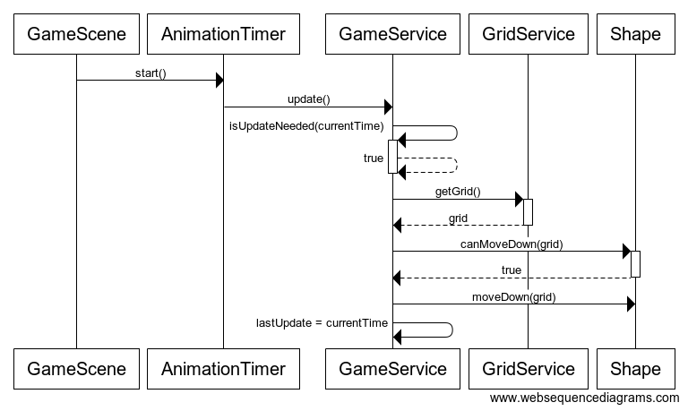
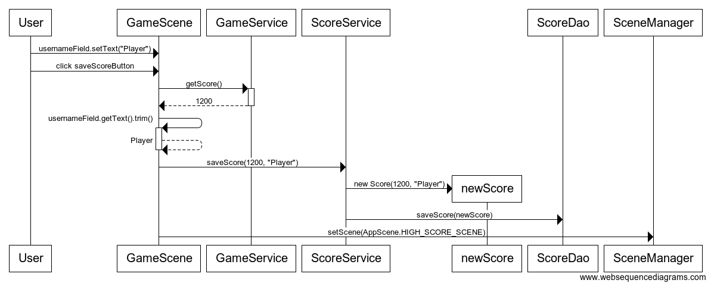

# Arkkitehtuurikuvaus
## Pakkausrakenne
Sovelluksen rakenne on variaatio kolmitasoisesta kerrosarkkitehtuurista,
ja sen pakkausrakenne on seuraavanlainen:

*Tetris.views* pakkaus sisältää pelin näyttämiseen ja käyttöliittymään liittyvän koodin.
*Tetris.controllers* sisältää pelin logiikan ja vastaa pelitilanteen päivittämisestä.
*Tetris.daos* vastaa tietokantaoperaatioista, ja *tetris.models* pakkaus sisältää sovelluksen käyttämät datamallit.

## Rakenne
Sovelluksen luokka- ja pakkausrakenne on kuvattu seuraavassa kaaviossa. Luokkiin injektoidaan niiden riippuvuudet
konstruktoria kutsuttaessa Googlen [Guice](https://github.com/google/guice/blob/master/README.md)-sovelluskehyksen avulla.

### Käyttöliittymä

Käyttöliittymä sisältää neljä näkymää: päävalikon ([MenuScene](https://github.com/mhaapakangas/ot-harjoitustyo/blob/master/tetris/src/main/java/tetris/views/scenes/MenuScene.java)),
pistetilaston ([HighScoreScene](https://github.com/mhaapakangas/ot-harjoitustyo/blob/master/tetris/src/main/java/tetris/views/scenes/HighScoreScene.java)),
pelinäkymän ([GameScene](https://github.com/mhaapakangas/ot-harjoitustyo/blob/master/tetris/src/main/java/tetris/views/scenes/GameScene.java))
ja asetukset ([SettingsScene](https://github.com/mhaapakangas/ot-harjoitustyo/blob/master/tetris/src/main/java/tetris/views/scenes/SettingsScene.java)).
Niistä jokaisella on oma Scene-olionsa. SceneManager-luokka hallinnoi näkymiä ja asettaa näytettävän näkymän Stage-olioon.

MenuScene sisältää vain linkit muihin sovelluksen näkymiin. Käyttöliittymän luokat eivät sisällä sovelluslogiikkaa, vaan
ne käyttävät tarvittaessa *tetris.controllers* pakkauksen luokkia. HighScoreScene hakee pistetilaston kutsumalla
[ScoreService](https://github.com/mhaapakangas/ot-harjoitustyo/blob/master/tetris/src/main/java/tetris/controllers/ScoreService.java)-luokan
metodia. SettingsScene asettaa pelin vaikeustason kutsumalla [LevelService](https://github.com/mhaapakangas/ot-harjoitustyo/blob/master/tetris/src/main/java/tetris/controllers/LevelService.java)-luokan
metodia. GameScene kutsuu [GameService](https://github.com/mhaapakangas/ot-harjoitustyo/blob/master/tetris/src/main/java/tetris/controllers/GameService.java)-luokan
metodia, joka päivittää pelitilannetta, ja piirtää Canvas-oliota käyttäen pelitilanteen. Lisäksi se käsittelee käyttäjän
antamat käskyt kutsumalla GameService-luokan metodeja. Kun peli päättyy, GameScene kutsuu ScoreService:n metodia ja tallentaa uudet pisteet.

### Sovelluslogiikka

Sovellus luo LevelService-rajapinnan toteuttavan [Singleton-luokan](https://github.com/mhaapakangas/ot-harjoitustyo/blob/master/tetris/src/main/java/tetris/controllers/LevelServiceImpl.java).
Se on vastuussa pelille valitusta vaikeustasosta, jota kuvaa [DifficultyLevel](https://github.com/mhaapakangas/ot-harjoitustyo/blob/master/tetris/src/main/java/tetris/models/DifficultyLevel.java)-luokka. 

[GameService](https://github.com/mhaapakangas/ot-harjoitustyo/blob/master/tetris/src/main/java/tetris/controllers/GameService.java)
vastaa meneillään olevan pelin tilanteesta eli pelissä olevasta palikasta, jäljellä olevista pudonneista palikoista,
pistetilanteesta ja pelin tasosta. Kun uusi peli alkaa, GameService lukee vaikeustason LevelService-luokan metodilla *getDifficultyLevel*,
ja asettaa pelin aloitustason sen perusteella.

Pelissä on kerrallaan yksi palikka, jota käyttäjä voi liikutella. Sitä kuvaa abstrakti [Shape](https://github.com/mhaapakangas/ot-harjoitustyo/blob/master/tetris/src/main/java/tetris/models/shapes/Shape.java)-luokka,
joka sisältää palikan liikuttamiseen ja pyörittämiseen liittyvän logiikan. Sovelluksessa on seitsemän Shape-luokasta periytyvää luokkaa,
jotka kuvaavat erimuotoisia palikoita. Ne määrittelevät palikan eri orientaatiot ja värin. 

GameService-luokan metodi *update* päivittää pelitilanteen tietyin väliajoin.
Pelitilannetta kuvaa 2-ulotteinen int-taulukko, jonka käsittelyyn liittyvä logiikka on [GridService](https://github.com/mhaapakangas/ot-harjoitustyo/blob/master/tetris/src/main/java/tetris/controllers/GridService.java)-luokassa.
Taulukon solut, joiden arvo on 0 ovat tyhjiä. Kun taulukkoon lisätään pudonnut palikka, muutetaan solujen arvoksi kyseisen
palikan väriä vastaava luku. GameService tarvittaessa lisää taulukkoon palikan tai poistaa täysiä rivejä kutsumalla
GridService-luokan metodeja.

### Tallennuslogiikka

[Score](https://github.com/mhaapakangas/ot-harjoitustyo/blob/master/tetris/src/main/java/tetris/models/Score.java)-luokka
kuvaa tallennettavaa pistetulosta.
[ScoreDao](https://github.com/mhaapakangas/ot-harjoitustyo/blob/master/tetris/src/main/java/tetris/daos/ScoreDao.java)-rajapinta
tarjoaa sovelluslogiikan käyttöön metodit uusien pisteiden tallennukseen sekä parhaiden pisteiden hakemiseen. Sen toteuttava
[ScoreDaoImpl](https://github.com/mhaapakangas/ot-harjoitustyo/blob/master/tetris/src/main/java/tetris/daos/ScoreDaoImpl.java)-luokka
sisältää logiikan pisteiden tallentamiseen sql-tietokantaan ja tiedon hakemiseen tietokannasta. ScoreDaoImpl ottaa
[DatabaseService](https://github.com/mhaapakangas/ot-harjoitustyo/blob/master/tetris/src/main/java/tetris/daos/DatabaseService.java)-luokan
avulla yhteyden sovelluksen käyttämään h2-tietokantaan. DatabaseService vastaa myös sovelluksen tarvitsemien tietokantataulujen luonnista.
Jos sovelluksen käyttämää tietokantaa halutaan vaihtaa, on ScoreDaoImpl- ja DatabaseService-luokat mahdollista korvata.

## Toiminnallisuus

### Pelitilanteen päivittyminen

Sekvenssikaavio pelitilanteen päivityksestä:

GameScene-luokan AnimationTimer piirtää pelitilanteen ja kutsuu GameServicen metodia *update*, joka päivittää pelitilanteen
kun edellisestä päivityksestä on kulunut tarpeeksi. Päivitysväli on sitä lyhyempi, mitä korkeampi pelin taso on. Koska
*isUpdateNeeded* metodi palauttaa arvon true, pelitilanne päivitetään. Shape-luokan metodi *canMoveDown* palauttaa arvon
true, joten palikkaa pudotetaan taulukossa yksi rivi alaspäin. Lopuksi GameService päivittää tiedon siitä, milloin pelitilanne
on viimeksi päivitetty.

Jos palikka ei voi enää pudota, se lisätään taulukkoon. Tätä tilannetta kuvaa seuraava sekvenssikaavio:

 

GameService lisää pudonneen palikan taulukkoon kutsumalla GridService-luokan metodia *addShapeToGrid*, minkä jälkeen se
 tyhjentää täydet rivit GridServicen *clearFullRows*-metodin avulla. *clearFullRows* palauttaa tyhjennettyjen täysien
 rivien lukumäärän. GameService päivittää rivien määrän perusteella pistetilanteen ja pelin vaikeustason. Sen
jälkeen peliin lisätään metodilla *getNewShape* uusi palikka. Shape-luokan metodi *hasValidPosition* palauttaa arvon
true, joten lisätty palikka ei ole aiempien palikoiden päällä, ja peli jatkuu. Muussa tapauksessa GameService merkitsisi
pelin päättyneeksi.

### Palikan liikuttaminen

Pelinäkymässä GameScene-luokan EventHandler kuuntelee pelaajan tekemiä näppäimen painalluksia, ja välittää
komennot eteenpäin kutsumalla GameService-luokan metodeja *moveShapeLeft*, *moveShapeRight*, *rotateShape* ja *dropShape*.

Sekvenssikaavio palikan liikuttamisesta vasemmalle:

GameService pyytää GridService-luokalta pelitilannetta kuvaavan taulukon, ja yrittää siirtää palikkaa vasemmalle kutsumalla
*moveShapeLeft*-metodia. Shape-luokka tarkistaa metodilla *isValidPosition*, voiko palikka liikkua haluttuun suuntaan.
Metodi palauttaa arvon true, joten liikkuminen onnistuu ja palikan sijainti päivitetään. Palikan liikuttaminen muihin
suuntiin tapahtuu vastaavalla logiikalla.

### Pelin päättyminen

Kun GameService merkitsee pelin päättyneeksi, GameScene piirtää GameOver-ilmoituksen, joka sisältää tekstikentän 
pelaajan nimelle. Kun pelaaja täyttää kenttään nimensä ja painaa *saveScoreButton* painiketta, tallennetaan
uusi tulos tietokantaan.

Sekvenssikaavio pistetuloksen lisäämisestä:
 
 

GameScene lukee pelaajan saavuttaman pistemäärän GameService-luokan metodilla *getScore* ja saa pelaajan syöttämän
nimen tekstikentästä. GameScene kutsuu ScoreServicen metodia *saveScore*, joka luo uuden Score-olion ja tallentaa sen
tietokantaan kutsumalla ScoreDao:n metodia *saveScore*. Kun pistetulos on tallennettu, GameScene kutsuu SceneManager-luokan
metodia *setScene* ja asettaa seuraavaksi näkymäksi HighScoreScene-näkymän.