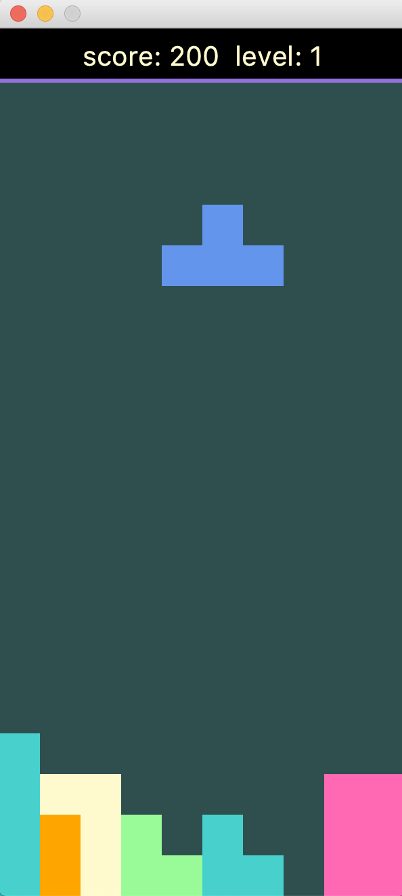

# Käyttöohje

Lataa tiedosto [tetris.jar](https://github.com/mhaapakangas/ot-harjoitustyo/releases/tag/viikko7)

## Ohjelman käynnistäminen
Sovellus käynnistetään komennolla

```
java -jar tetris.jar
```

## Päävalikko

Sovellus käynnistyy päävalikkoon:


Valikon painikkeesta *New game* voi aloittaa uuden pelin. *High scores* painikkeesta
näkee pistetilaston, ja *Settings* painikkeesta voi valita pelin asetukset.

## Asetuksien valinta

Asetukset-näkymästä voi valita pelin vaikeustason:


Vaikeustasoja on kolme: helppo, normaali ja vaikea. Korkeammalla vaikeustasolla
peli alkaa korkeammalta tasolta, ja palikat putoavat pelissä nopeammin. Oletuksena
pelin vaikeustasoksi on asetettu helppo. *Back to Menu* painikkeesta pääsee takaisiin päävalikkoon.

## Pelin pelaaminen
Uusi peli käynnistyy automaattisesti painikkeesta *New game*.



Pelin tetris-palikkaa voi liikutella seuraavasti:

| Näppäin      | Tapahtuma |
| ----------- | ----------- |
| Vasen-nuoli  | Liikuta palikkaa vasemmalle |
| Oikea-nuoli  | Liikuta palikkaa oikealle |
| Ylös-nuoli  | Käännä palikkaa |
| Alas-nuoli  | Pudota palikka |

Pelinäkymän ylälaidassa näkyy sen hetkinen pistetilanne ja pelin taso.
Kun pelajaa muodostaa palikoista täysiä rivejä, niistä kerääntyy pisteitä ja täydet rivit
poistetaan. Pisteitä saa sitä enemmän, mitä useampia rivejä täyttää kerralla. Lisäksi
pisteet kerrotaan pelin tason mukaisella kertoimella. Peli etenee seuraavalle tasolle,
kun täysiä rivejä on muodostanut tarpeeksi monta.

## Pelin päättyminen
Peli päättyy, kun uusi palikka ei enää mahdu peliruutuun. Silloin pelinäkymään
ilmestyy Game over -ilmoitus:


Pelaaja voi lisätä nimensä Game over -näkymän tekstilaatikkoon. Tyhjät nimet eivät ole sallittuja,
ja jos syötetty nimi on pidempi kuin 15 merkkiä, siitä tallennetaan vain 15 ensimmäistä. Nimen syöttämisen
jälkeen pistetuloksen voi tallentaa *Save score* painikkeesta.

## Pistetilasto
Pelin päättymisen jälkeen pelaaja näkee pistetilaston, jota pääsee katsomaan myös päävalikon *High scores*
painikkeesta.


 
Pistetilasto näyttää korkeintaa 10 parasta pistetulosta ja ne tehneet pelaajat. *Back to Menu* painikkeesta
pääsee takaisiin päävalikkoon.
