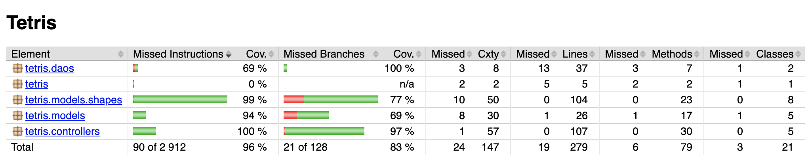

# Testausdokumentti

## Yksikkö- ja integraatiotestaus

Sovellusta on testattu automatisoiduilla JUnit yksikkö- ja integraatiotesteillä. 
Testattujen luokkien riippuvuudet on korvattu [Mockito](https://site.mockito.org/)-kirjaston mock-olioilla.

### Sovelluslogiikka

[GameServiceTest](https://github.com/mhaapakangas/ot-harjoitustyo/blob/master/tetris/src/test/java/tetris/controllers/GameServiceTest.java)-luokan
integraatiotestit testaavat sovelluksen pelilogiikkaa. Ne kattavat eri tilanteet, jotka ovat mahdollisia kun
metodia *update* kutsutaan: pelin päivittymisen vain jos viime päivityksestä on tarpeeksi aikaa, pelin päättymisen,
palikan liikuttamisen yhden rivin alaspäin sekä täysien rivien käsittelyn palikan pudottua. Lisäksi luokka
testaa niiden metodien toiminnan, joita GameScene kutsuu, kun pelaaja haluaa liikutella palikkaa.

Pelitilannetta kuvaavan 2-ulotteisen taulukon käsittely on testattu yksikkötesteillä 
[GridServiceTest](https://github.com/mhaapakangas/ot-harjoitustyo/blob/master/tetris/src/test/java/tetris/controllers/GridServiceTest.java)-luokassa.
[ScoreServiceTest](https://github.com/mhaapakangas/ot-harjoitustyo/blob/master/tetris/src/test/java/tetris/controllers/ScoreServiceTest.java)
testaa metodit, joiden välityksellä HighScoreScene ja GameScene käyttävät tietokantaa.
[ShapeGeneratorTest](https://github.com/mhaapakangas/ot-harjoitustyo/blob/master/tetris/src/test/java/tetris/controllers/ShapeGeneratorTest.java)-luokan
yksikkötestit varmistavat, että peli luo oikeanlaisen palikan oikealla sijainnilla. Pelin vaikeustason muuttaminen
on testattu [LevelServiceImplTest](https://github.com/mhaapakangas/ot-harjoitustyo/blob/master/tetris/src/test/java/tetris/controllers/LevelServiceImplTest.java)-luokassa.

### Tallennuslogiikka

[ScoreDaoImplTest](https://github.com/mhaapakangas/ot-harjoitustyo/blob/master/tetris/src/test/java/tetris/daos/ScoreDaoImplTest.java)-luokan
testitapaukset kattavat uuden pistetuloksen tallennuksen ja parhaiden pisteiden hakemisen
tietokannasta.

### Datamallit

Shape-luokasta periytyvät luokat, jotka kuvaavat erimuotoisia palikoita, on testattu pakkauksen
[tetris.models.shapes](https://github.com/mhaapakangas/ot-harjoitustyo/tree/master/tetris/src/test/java/tetris/models/shapes)
testiluokissa. Luokkien yksikkötestit kattavat palikoiden liikuttamiseen ja pyörittämiseen liittyvän
logiikan sekä testaavat Shape-luokan *equals*-metodia.

[ScoreTest](https://github.com/mhaapakangas/ot-harjoitustyo/blob/master/tetris/src/test/java/tetris/models/ScoreTest.java)
testaa Score-luokan *equals*-metodia, ja [PositionTest](https://github.com/mhaapakangas/ot-harjoitustyo/blob/master/tetris/src/test/java/tetris/models/PositionTest.java)
vastaavasti sijaintia kuvaavaa Position-luokkaa.

### Testauskattavuus

Käyttöliittymän rakentavan *tetris.views* pakkauksen luokkia lukuunottamatta sovelluksen testauksen
rivikattavuus on 96 % ja haaraumakattavuus 83 %.

Testaus ei kata [DatabaseService](https://github.com/mhaapakangas/ot-harjoitustyo/blob/master/tetris/src/main/java/tetris/daos/DatabaseService.java)-luokkaa,
joka luo tietokantataulut ja ottaa yhteyden h2-tietokantaan, eikä kaikkia [Lombok](https://projectlombok.org/)-apukirjaston
@EqualsAndHashCode-annotaatiolla generoitujen *equals*- ja *hashCode*-metodien haaroja.

## Järjestelmätestaus

Sovelluksen järjestelmätason testaus on suoritettu manuaalisesti. Sovellus on asennettu ja käynnistetty
[käyttöohjeen](kayttoohje.md) mukaisesti OSX-ympäristössä.

Järjestelmätestaus kattoi [vaatimusmäärittelyn](requirements.md) kuvaaman toiminnallisuuden. Nimen syöttäminen on testattu
myös virheellisillä arvoilla, kuten tyhjällä tai liian pitkällä nimellä. 